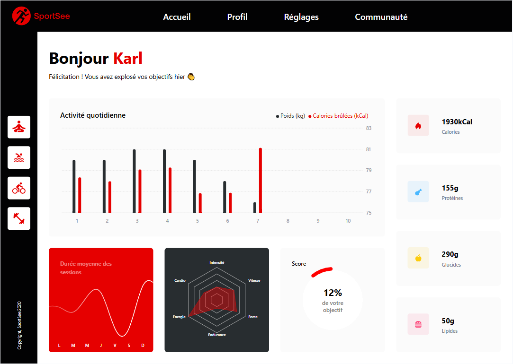

# P12 - Tableau de bord SportSee



## Technologies utilisées

<p align="center">
  <a href="https://skillicons.dev">
    
  </a>
</p>

- [ViteJS](https://vitejs.dev/)
- [React](https://reactjs.org/)
- [React Router](https://reactrouter.com/)
- [Recharts](https://recharts.org/)
- [Fetch](https://developer.mozilla.org/en-US/docs/Web/API/Fetch_API)

## Installation Backend

1. Cloner le dépôt :

```
git clone https://github.com/OpenClassrooms-Student-Center/SportSee.git
```

2. Prérequis :

- [NodeJS](https://nodejs.org/en/)
- [Yarn](https://yarnpkg.com/)

3. Installer les dépendances :

```
yarn
```

4. Lancer le serveur :

```
yarn dev
```


## Installation Frontend

1. Cloner le dépôt :

```
git clone https://github.com/vatr84/P12_SportSee.git
```

2. Prérequis :

- [NodeJS](https://nodejs.org/en/)

3. Accédez au dossier du projet :

```
cd P12_SportSee
```

4. Installer les dépendances :

```
npm install
```

5. Démarrez l'application :

```
npm run dev
```

## Liste des dépendances qui seront installées:

- [React.js](https://react.dev/) est une bibliothèque JavaScript permettant de créer des interfaces utilisateur.
- [React-router](https://www.npmjs.com/package/react-router) est un package utilisé pour créer des liens permettant d'utiliser React Router dans des applications Web.
- [Prop-types](https://github.com/facebook/prop-types) sont utilisés dans les composants React pour valider les types de props (ou propriétés) que le composant reçoit. Cela garantit que les données transmises au composant ont les types attendus et évite les erreurs lors de l'exécution du programme. Les proptypes sont donc un outil utile pour améliorer la fiabilité et la maintenabilité des composants React.
- [Recharts](https://recharts.org/en-US) est une bibliothèque de composants graphiques basée sur React pour créer des graphiques et des visualisations de données. Elle fournit une grande variété de types de graphiques couramment utilisés tels que les graphiques à barres, les graphiques à secteurs, les graphiques linéaires, les cartes, etc.

## Utilisation

L'application fonctionne en utilisant un mock de l'API ainsi que les vraies données API. Deux utilisateurs sont disponibles : 12 et 18. En modifiant le fichier `.env`, vous pouvez basculer entre le mode développement (mock) `VITE_APP_USE_MOCKED_DATA=true` et production (API) `VITE_APP_USE_MOCKED_DATA=false`.

## Ressources

- [Maquettes](https://www.figma.com/file/BMomGVZqLZb811mDMShpLu/UI-design-Sportify-FR?node-id=0%3A1)
- [Kanban](https://www.notion.so/openclassrooms/Copy-of-Dev4U-projet-Learn-Home-6686aa4b5f44417881a4884c9af5669e)
